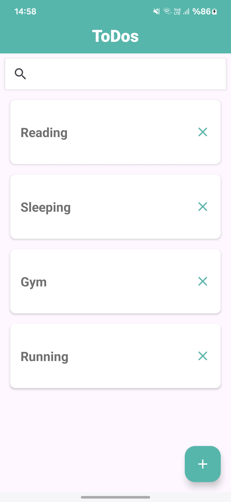
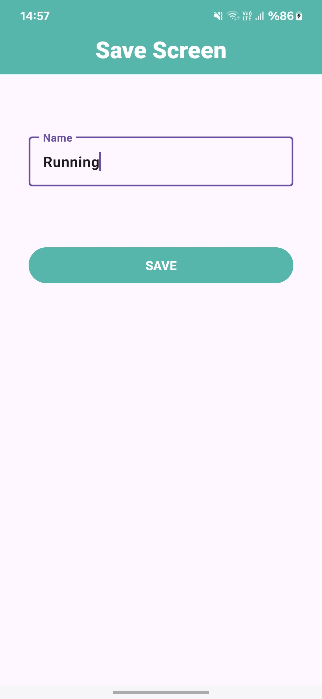
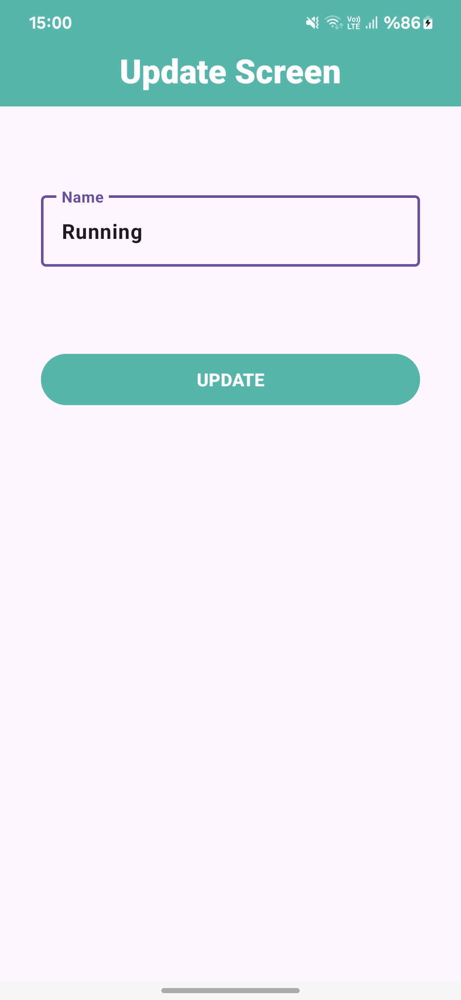
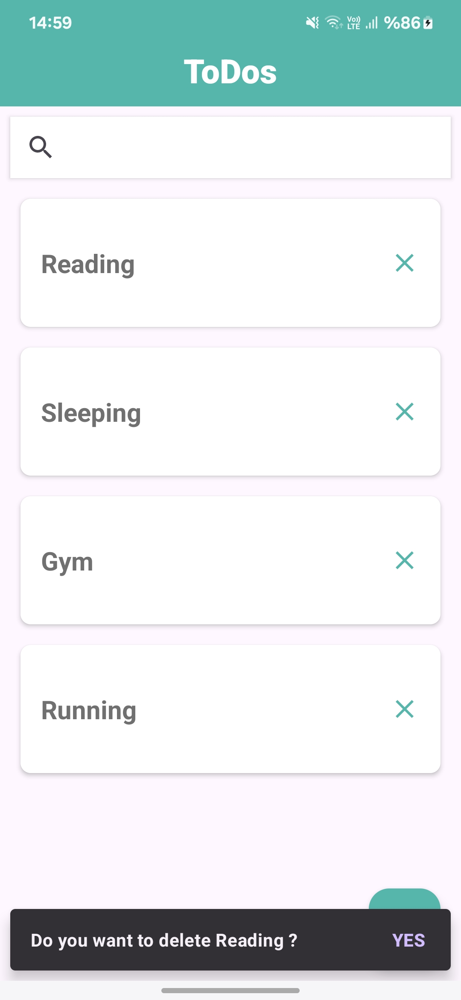
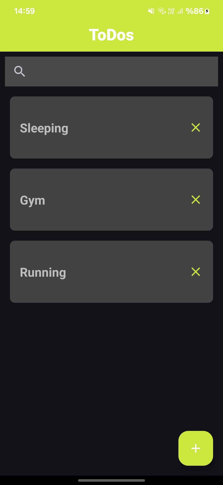

# MVVMToDo
 MVVMToDoApp

Bu proje, MVVM (Model-View-ViewModel) mimarisi kullanılarak geliştirilmiş bir To Do uygulamasını içermektedir.

## Genel Bakış

Bu To-Do uygulaması, kullanıcıların günlük görevlerini takip etmelerine yardımcı olmak için tasarlanmıştır. Kullanıcılar, yapılacaklar listesine görevler ekleyebilir, düzenleyebilir ve silebilirler.


## Özellikler

- Yapılacaklar listesi oluşturma: Kullanıcılar, yapılacak görevlerini listeye ekleyebilirler.
- Görevleri düzenleme: Kullanıcılar, ekledikleri görevleri düzenleyebilirler.
- Görevleri silme: Kullanıcılar, artık yapmak istemedikleri görevleri silebilirler
  
## Kullanılan Teknolojiler

- Kotlin

- Android Architecture Components (ViewModel, LiveData)

- ViewBinding

- NavigationComponent

- Retrofit

- Glide

- Database(room)

- Coroutines

- RecyclerView

- Dependecy Injection


- ## Ekran Görüntüleri








## Kurulum

Proje dosyalarını bilgisayarınıza klonlayın veya ZIP olarak indirin. Android Studio'da açın ve emülatör veya fiziksel bir cihaz üzerinde çalıştırın.

```bash
https://github.com/hariellevardamir/MVVMToDo.git
